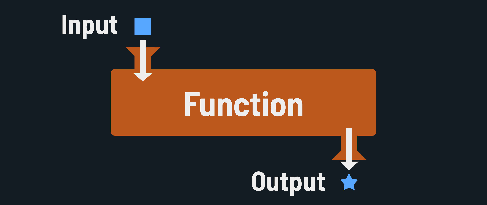

<h1>
  Intermediate Python for Scripting
  Function Concepts
</h1>

**Learning objective:** By the end of this lesson, students will be able to explain how functions can simplify complex tasks and promote code reuse.

## What is a function?

A function is a reusable block of code written to perform a single purpose. With a function, you can store code that can be used conveniently as many times as you wish without having to rewrite the code each time. As a result, functions are one of the fundamental building blocks of Python, and you'll find and use them everywhere.

Functions optionally take in data as input and return a single piece of data (including complex data such as objects or other functions).

> 📚 A *function* is a block of code that can be called as needed and is designed to perform a specific task. A function may accept input and can return a result after completing its task.

## Why are functions essential in programming?

### Tackle complexity

We typically tackle a complex task by breaking it into smaller tasks or steps - when we're programming, we want to do the same! Functions allow us to break up programs into more manageable blocks of code.

### Code reuse

Functions provide code reuse because they can be called repeatedly. For example, an `addComment` function might be called every time a user adds a comment to a social media post.

### Documentation & debugging

Naming functions appropriately, for example a name like `addComment` helps document what that function's job is (to add a user's comment to the list of comments). Organizing code into functions also makes it easier to find and fix code that's not working as expected, a process known as debugging.
