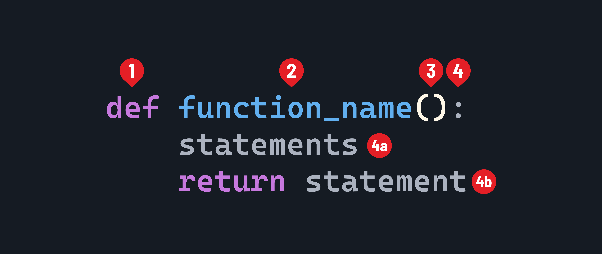

<h1>
  <span class="headline">Intermediate Python for Scripting</span>
  <span class="subhead">Functions and Modular Code</span>
</h1>

**Learning objective:** By the end of this lesson, students will be able to define and use functions in Python so they're able to write modular and reusable code.

## Function syntax

Functions are a fundamental building block of any programming language, and mastering them is crucial for writing clean, reusable, and modular code.

A function definition will have the following syntax:



1. The `def` keyword.
2. The name of the function. It should be written in `snake_case`.
3. The parameter list, inside parentheses.
4. The body of the function is indicated by a colon.
   - 4a. The statements that make up the function itself. These must be indented.
   - 4b. Optionally, a `return` statement.

## Defining and calling functions

At its core, a function is a block of code that performs a specific task. It takes input, processes it, and optionally returns a result. In Python, we define a function using the `def` keyword, followed by the function name and a pair of parentheses.

Here's a function that prints some text:

`intermediate_python.py`

```python
def print_banner():
    print("=======================")
    print("Insert banner text here")
    print("=======================")
```

A function must be called for it to run.

If we wanted to call the `print_banner()` function from our previous example, we would do so like this:

`intermediate_python.py`

```python
print_banner()
```

You can call a function multiple times, and each time it will execute the code inside the function body. For example:

`intermediate_python.py`

```python
print_banner()
print_banner()
```

This will print the banner text twice.

## Function parameters and arguments

Inside the parentheses, we can specify *parameters* that the function accepts. Here's an example:

`intermediate_python.py`

```python
def greet(name):
    print(f"Hello, {name}!")
```

In this example, we define a function called `greet` that takes a parameter `name`. The function body is indented and contains a single line of code that prints a personalized greeting.

To call a function, we simply use its name followed by a pair of parentheses and provide the necessary *arguments*, if any. For instance, to call the `greet` function, we can do:

`intermediate_python.py`

```python
greet("Alice")
# Prints: Hello, Alice!
```

Functions can be passed *arguments*, which are variables that receive the values passed to the function when it is called. Parameters allow functions to be more flexible and reusable by enabling them to work with different data.

In the `greet` function example, `name` is a parameter that accepts a value when the function is called. The value passed to the function is called an argument. In the line `greet("Alice")`, `"Alice"` is the argument that is passed to the name parameter.

## Return values

Functions can return values using the `return` statement. The return statement allows a function to send a value back to the caller and exit the function. Here's an example:

`intermediate_python.py`

```python
def square(num):
    return num ** 2
```

In this example, the `square` function takes a number `num` and returns its square using the `return` statement.

`intermediate_python.py`

```python
result = square(5)
print(result)
# Prints: 25
```

In this case, the `square` function returns the value `25`, which is then stored in the variable `result`. The `print` statement outputs the value of `result`.

## Variable scope

When a function is called, a new local scope is created. Variables defined inside a function are local to that function and cannot be accessed from outside the function. Variables defined outside the function, in the global scope, can be accessed inside the function. Here's an example:

`intermediate_python.py`

```python
num = 10  # Global variable

def print_num():
    print(num)  # Accessing global variable

def modify_num():
    num = 20  # Local variable
    print(num)
    # Prints: 20
    num = num + 10
    print(num)
    # Prints: 30
    # The local variable num is modified, but it does not affect the
    # global variable num

print_num()
# Prints: 10
modify_num()
# Prints: 20
print(num) 
# Prints: 10
```

In this example, `num` is a global variable defined outside the functions.

The `print_num` function can access and print the value of `num`.

The `modify_num` function creates a new local variable `num` and assigns it a value of `20`, which is separate from the global `num`.

Modifying the local `num` inside the function does not affect the global `num`.

## Best practices for writing functions

When writing functions, it's important to follow best practices to make your code more readable, maintainable, and reusable. Here are some key best practices:

1. **Naming:** Use descriptive and meaningful names for functions that clearly indicate their purpose. Follow the convention of using lowercase letters and underscores for function names (for example, `calculate_average` or `get_user_input`).

2. **Single responsibility principle:** Functions should have a single, well-defined responsibility. Each function should do one thing. Avoid creating functions that have multiple unrelated tasks - use multiple functions instead.

3. **Input validation:** Validate the input parameters of a function to ensure they meet the expected criteria. Handle invalid input gracefully and provide appropriate error messages or raise exceptions if necessary.

4. **Commenting:** Write comments to explain the purpose, parameters, and return values of a function. Use docstrings to provide a clear and concise description of what the function does.

5. **Return values**: Functions should return meaningful values that can be used by the caller. Avoid returning `None` or `False` to indicate success or failure. Instead, use exceptions or return explicit values.

6. **Code reusability:** Strive to write functions that are modular and reusable. Break down complex tasks into smaller, reusable functions that can be used in different parts of your code.

7. **Testing**: Test your functions thoroughly to ensure they work as expected. Write unit tests to verify the behavior of individual functions and integration tests to check how functions work together.

By following these best practices, you can write clean, efficient, and maintainable code that leverages the power of functions in Python.

<div class="activity solo-exercise">
  <h2 class="title">Build your first function</h2>
  <span class="minutes">10 min</span>
</div>

Implement a function named `calculate_average` that takes two numbers as input and returns the average of those numbers. Test your function with different numbers.
